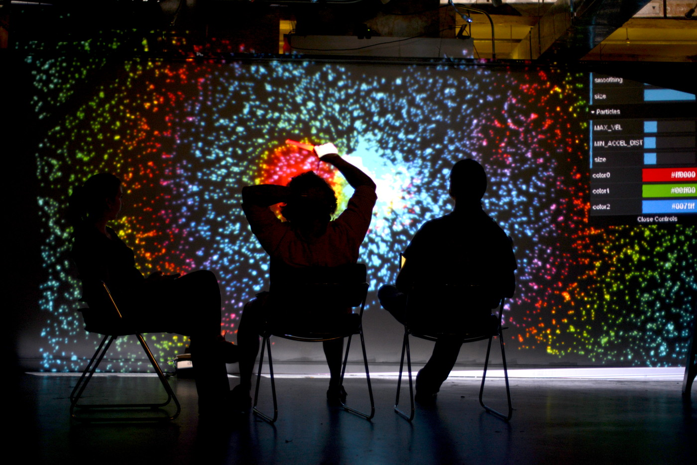

Digital Motion Renderer, 2015
=============================

A spiffy, new, ultra customizable visualization renderer for interactive art
exhibits.

What's so new?
--------------

Last year, contributing a visualization to DiMo involved building a
JavaScript-based web renderer from the ground up.  The only shared code was
some re-pasted WebSockets boilerplate.

DiMo 2015 will standardize on a single renderer, with a streamlined approach to
contributions.

Last years' DiMo
----------------

 - [DiMo 2014][dimo2014]

[dimo2014]: http://palebluepixel.org/projects/dimo/
