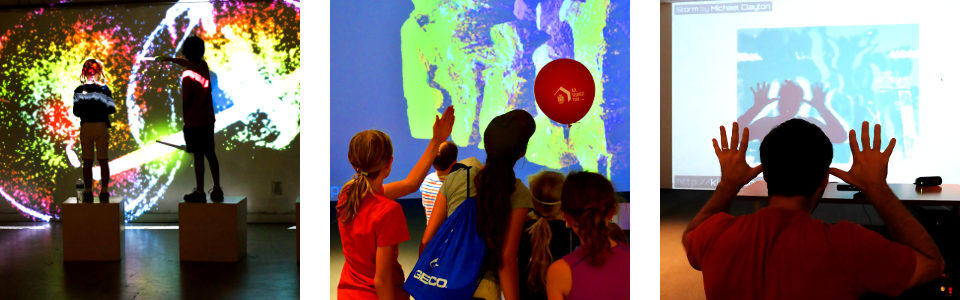

Make a Kimotion!
================

A framework for building interactive art.

Pics are good but [videos are better][videos].

Quick-start
-----------

Here's the fastest way to get set up:

 1. Clone or download this repository
 2. `./start.sh`
 3. Open [http://localhost:8000](http://localhost:8000)

By default, Kimotion plays a recording, so you don't need a Kinect or Leap to
have fun.

Creating your own mod
---------------------

This needs to be added to the README.  Until then, please see [Kimotion Modding
101][modding-101].

Kinect installation
-------------------

In order to run Kimotion with live data from a Kinect, a few more things need
to be installed:

 - [Node.js][node] and npm: Fedora: `yum install nodejs npm`, Ubuntu: `apt-get
   install nodejs npm`

 - [NumPy][numpy]: Fedora: `yum install numpy`, Ubuntu: `apt-get install
   python-numpy`

 - [libfreenect][freenect] (with python bindings), which you'll need in order
   to hook up a real Kinect via USB.  On Fedora, `yum install libfreenect
   libfreenect-python`, on Ubuntu: `apt-get install freenect python-freenect`.

Once those are installed, launch the websocket server:

    cd server
    python server.py

Then open Kimotion (see quick-start), choose a mod that uses the Kinect, like
'sandstorm'.  Voila!

Leap Motion installation
------------------------

This needs to be added to the README.  Until then, please see [Kimotion Modding
101][modding-101].

2D mods and 3D mods
-------------------

In the constructor of your mod, you may choose which mode to use, 2D or 3D.

**2D mode** uses the excellent [p5js][p5js] library.  This mode is easier to get
started with, so I recommend using it first.

To enable 2D mode, place this in your mod's constructor:

    this.set_graphics('2d');

**3D mode** uses the equally excellent [threejs][threejs] library.  It's larger
than p5, and has a steeper learning curve, but if you'd like to use some 3D
effects, go for it!  Some of the existing mods use threejs, so peek at them for
some examples.

To enable 3D mode, place this in your mod's constructor:

    this.set_graphics('3d');

Exhibits
--------

 - [Digital Motion 2014][dimo2014]
 - [Kimotion @ Digital Motion 2015][dimo2015]

FAQ
---

 - What's up with bower?  Front-end libraries *are* managed in bower, but I
   take it upon myself to copy the installed versions directly into this repo.
   It's a tradeoff, but the benefit is that newcomers can contribute to
   Kimotion without installing anything.

Making your own Leap Motion Recording
-------------------------------------

Follow these steps to create a recording:

 1. With your Leap plugged in, go to the [Leap recorder][leap-rec] page.
 2. Click **Record** to begin the recording
 3. **Wave your hand around!**
 4. When done, click **Record** again to stop the recording.
 5. Click **Download**

You should now have a file named something like
`leap-playback-recording-110fps.json.lz`.  Now let's copy that recording into Kimotion.

 1. Move your `leap-playback-recording-110fps.json.lz` file into your mod's
    directory.  For example, `src/mods/mymod/`.
 2. Rename it to something shorter (optional), like `recording.json.lz`.
 3. Open your mod's `main.js` file, find the `set_input` call and add the path
    to your recording.

For example:

    // before
    this.set_input('leap');
    // after!
    this.set_input('leap', 'mods/example2d/recording.json.lz');

Your mod now has its own recording!  Refresh your mod to see it.  Make sure the
**"Use recording?"** box is checked!

[dimo2014]: http://palebluepixel.org/projects/dimo/
[dimo2015]: http://palebluepixel.org/2015/09/26/make-a-kimotion/
[server]: /server
[node]: https://nodejs.org/
[freenect]: http://openkinect.org/wiki/Getting_Started
[numpy]: http://www.numpy.org/
[slides]: http://kimotion.xyz/slides/hackathon
[threejs]: http://threejs.org/
[p5js]: http://p5js.org/
[videos]: https://vimeo.com/couchmode/album/3492711
[leap-rec]: http://leapmotion.github.io/leapjs-playback/recorder/
[modding-101]: http://palebluepixel.org/2016/08/28/kimotion-modding-101/
